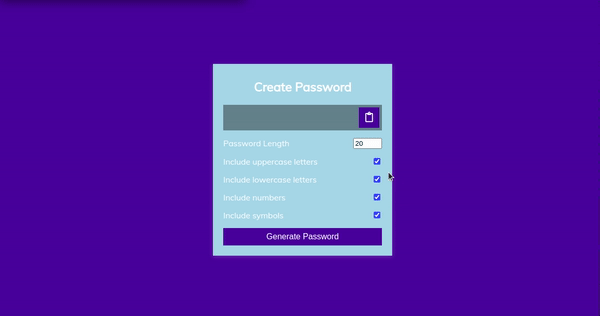

# JavaScript Color changer project

- This is Javascript mini-Project. In this project I have made a **Random Password generator** with JavasCript, which generates random password everytime.

- You can also specify what type of character you want like uppercase alphabets, lowercase alphabets, numbers and symbols.

- You can specify length of the password and also can copy the password to your **clipboard**

- I have also added a surprise to it, so do check it out. The live link is given below.

- It took me 5-6 hrs to make this project.

  

---

## 🛠 Skills learned

- JavaScript
- To Use DOM
- Copying a text to your clipboard on click
- Creating Elements in Javascript
- Adding Elements in HTML using JavaScript
- Adding Attributes to the Elements

---

## 🎥 Working

---

## 🚀 About Me

### Hey, I am Yasir lambawala

- I am born and brought up in Vadodara, Gujarat. I have done my Btech at GTU university and I am currently learning Web-development.

---

## Feedback

- If you have any feedback, please reach me at lambawalay@gmail.com
